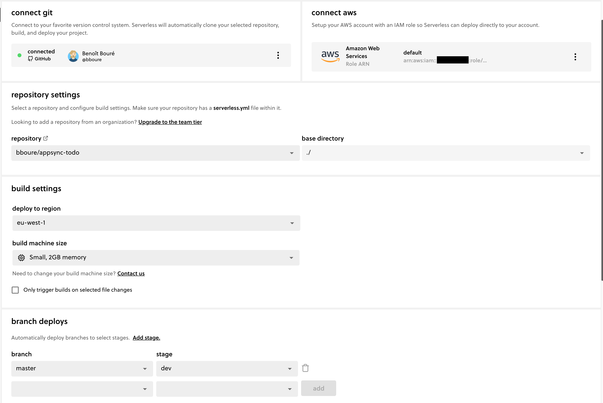
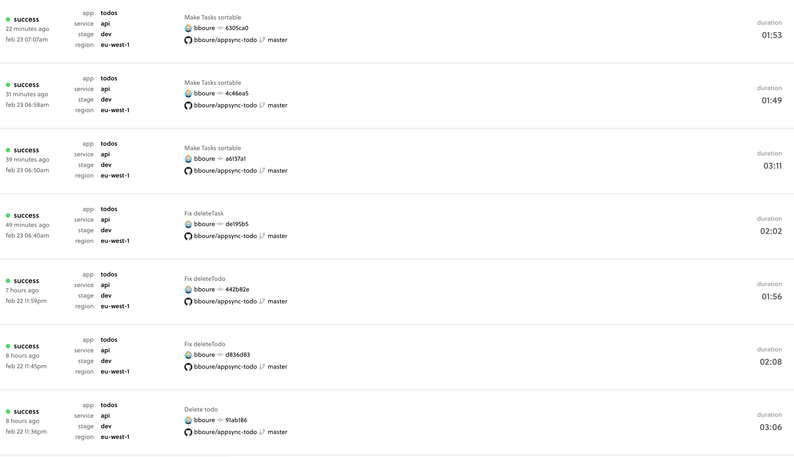

# Getting started

```bash
# install dependencies
npm i
# install dynamodb local (Optional, for local testing only)
sls dynamodb install
```

# Deployment

Deployment is automated through the [serverless.com](https://serverless.com) Dashboard.

Ci/Ci configuaration


Every push to master deploys the dev stage.

ci/cd logs


Manual deployment can also be done with the following command

```bash
sls deploy -s dev #change the -s param to deploy another stage
```

# Working offline

You can test your API locally thanks to the [bboure/serverless-appsync-simulator](https://github.com/bboure/serverless-appsync-simulator) plugin.

```bash
sls offline start
```
